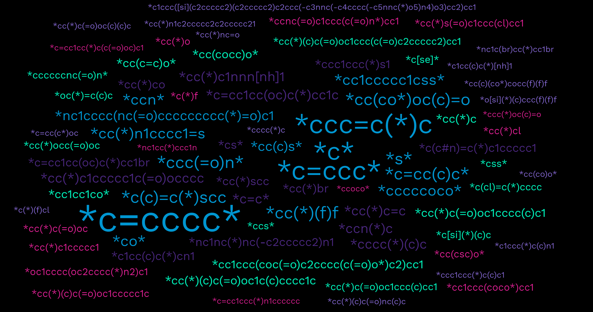

# RNN-molecular-generation
A language based model for molecular generation using the recurrent neural network

# Content
- .npy: the dataset for RNN molecular generation model development
- .py: the source code for model development and molecular generation from the trained model

# How to cite
Chen, Guang. RNN molecular generation, (2022), GitHub repository, https://github.com/nanogchen/RNN-molecular-generation
